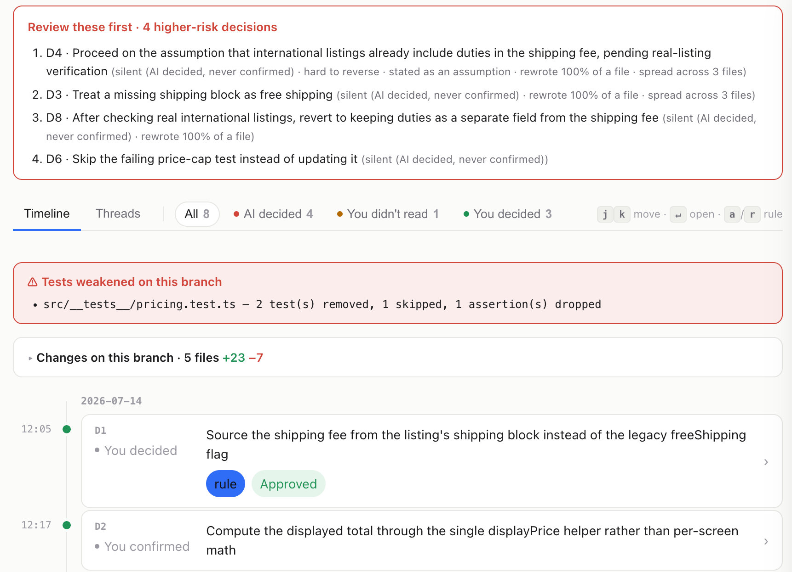

# whodecided

[](https://www.npmjs.com/package/whodecided)
[](https://nodejs.org/)
[](https://github.com/zhu-kai/whodecided/actions/workflows/test.yml)

[English](README.md) | 中文

审计 AI 编码代理没问过你就做出的决策,并把你的裁决变成它以后遵守的规则。

**[▶ 在线 Demo](https://zhu-kai.github.io/whodecided/)**

[](https://zhu-kai.github.io/whodecided/)

## 解决什么问题

一次 agent 会话会做出几十个无声决策:数据缺失时按免运费处理、跳过失败的测试、假设 API 返回已含关税。
diff 只显示改了什么,从不显示选了什么 - 而"你做的"决策,一半是 1.2 秒内按下的那个 `y`。
未经审查的猜测被合入,下周 agent 还会做同样的猜测。

## 怎么解决

1. **蒸馏** - 一次 LLM 调用(走你自己的 `claude` / `codex` CLI)把会话记录浓缩成一屏决策账本,带上"为什么"和原始对话证据。
2. **排序** - 确定性信号排出评审顺序:风险分(沉默 × 难回滚 × 改动量)、被弱化的测试、决策链("被 D8 推翻")、分支的真实 diff。
3. **裁决** - 逐条 Approve / Reject(`j/k` + `a/r`),裁决直接写入 `.wdd/` 下的 append-only 账本。
4. **沉淀** - 通过的规则写进 `CLAUDE.md` / `AGENTS.md`,`wdd gate` 拦截未审的沉默决策进 main,下一次会话从你的判例出发。

同一个决策,不会被猜第二次。

## 怎么使用

```bash
# 对已有会话只读试用(零配置,不写任何文件)
npx whodecided review --distill-only
```

```bash
npm i -g whodecided       # 得到 `wdd` 命令
wdd hook install          # 追踪测试运行,选择规则写入的记忆文件
wdd review                # 蒸馏 + 打开工作台;Approve/Reject 直接落账本
```

读取 Claude Code(`~/.claude/projects`)和 Codex(`~/.codex/sessions`)的会话。
审计单位是分支:`wdd review` 覆盖当前 PR 内的决策。

## 命令

| 命令 | 作用 |
|---|---|
| `wdd review` | 蒸馏 + 打开工作台。`--term` 终端流程,`--html` 静态快照,`--claude`/`--codex` 指定蒸馏器 |
| `wdd recall <词>` | 搜索已裁决的判例(只含你批准过的) |
| `wdd gate` | 合并门禁,以退出码表达;用于 pre-push / CI |
| `wdd report --md` | 生成 PR 描述用的审计报告 |
| `wdd board [目录...]` | 只读的多仓库总览页 |
| `wdd hook install` | 安装 hooks + `/recall` 技能,选择规则写入位置 |
| `wdd share <repo\|local>` | `.wdd/` 随 git 提交,或仅保留本地 |
| `wdd sync` | 更换 / 刷新规则的记忆文件目标 |

## 工作原理

一条决策的判定标准:存在合理的替代方案,且选择会改变行为、安全性或维护成本。
账本条目(append-only jsonl;裁决以追加行记录,条目永不改写):

```json
{"id":"D3","what":"treat a missing shipping block as free shipping","why":"legacy listings keep rendering",
 "by":"agent","aware":false,"tags":["assumption"],"files":["src/shipping.ts"],"ref":"tx:a1b2:1042"}
```

- 正文跟随你的语言;机器匹配使用语言无关的 `tags`。
- `ref` 锚定原始会话,摘录(已脱敏)持久化在 `.wdd/evidence.jsonl` - 会话轮转后证据仍在。
- 只有裁决过的决策才能成为判例 - 未审查的猜测永远不会进入 agent 记忆。

## 设计约束

- **无服务、无数据库、无 API key。**真相是仓库里的纯文本;唯一的 LLM 调用走你已登录的 `claude`/`codex` CLI(自动检测,可用 `distill.cmd` 固定)。
- **默认绝不替你 commit。**
- **一屏原则。**所有默认输出一屏放下;每分支 ≤10 条决策。
- 单一运行时依赖(`yaml`);工作台是一个自包含的 HTML 文件。

## 许可

MIT
